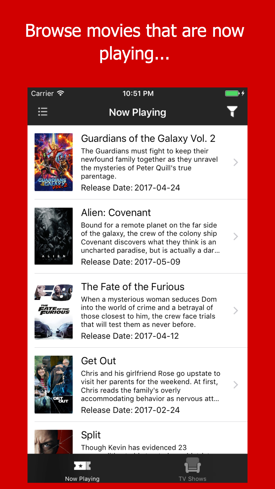

# swiftobjc
An app that utilizes TMDb API for displaying list of movies with details having a filter for minimum and maximum years.

##Datepicker

##Filter View

##Detail View

##Movies List View

##Filter with Release Date

##Cocoapods: 
(User of OpenSource)
SCPopDatePicker
TMDBSwift
Kingfisher
