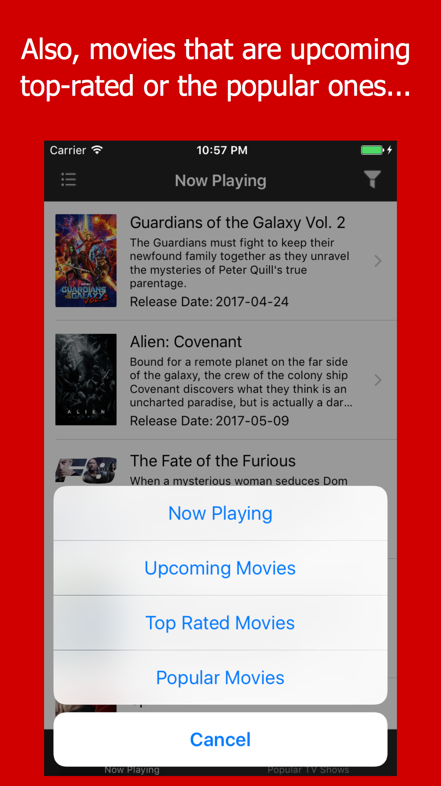
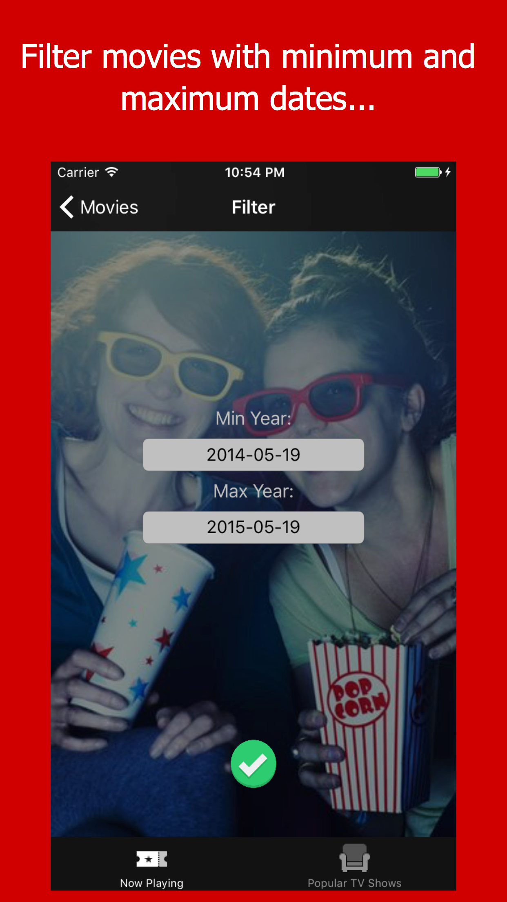

# swiftobjc
An app that utilizes TMDb API for displaying list of movies with details having a filter for minimum and maximum years.

Movies List View🕶             |  Filter with Release Date🌻
:-------------------------:|:-------------------------:
  |  
Detail View🕶             |  Filter View🌻
  |  

TV Shows🕶             |  
:-------------------------:
  |

## Cocoapods: 
(Use of OpenSource)
SCPopDatePicker,
TMDBSwift,
Kingfisher.
